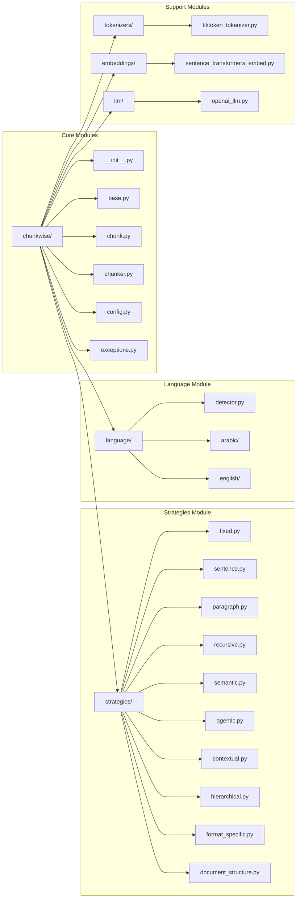
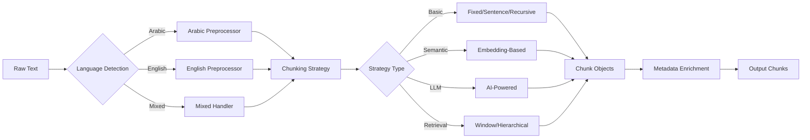

# ChunkWise

**Text Chunking Library for Arabic and English**

A Python library implementing multiple text chunking strategies with support for both Arabic and English languages. Designed for RAG systems, NLP pipelines, and document processing.

## Author

**Hesham Haroon**

For support, questions, or commercial licensing inquiries:
- Email: heshamharoon9@gmail.com
- GitHub: [@h9-tec](https://github.com/h9-tec)

## Features

- **31 Chunking Strategies** across 7 categories
- **Arabic Language Support** with diacritics handling and normalization
- **English Language Support** with sentence detection
- **Automatic Language Detection**
- **Embedding-Based Chunking** (requires sentence-transformers)
- **LLM-Based Chunking** (requires OpenAI/Anthropic API)

## Project Architecture

```mermaid
graph TB
    subgraph "ChunkWise Library"
        A[Chunker] --> B[BaseChunker]
        B --> C[Strategies]
        B --> D[Language Support]
        B --> E[Tokenizers]

        subgraph "Strategies"
            C --> C1[Basic]
            C --> C2[Document Structure]
            C --> C3[Format-Specific]
            C --> C4[Semantic]
            C --> C5[LLM-Based]
            C --> C6[Retrieval-Optimized]
            C --> C7[Hybrid]

            C1 --> C1a[CharacterChunker]
            C1 --> C1b[TokenChunker]
            C1 --> C1c[WordChunker]
            C1 --> C1d[SentenceChunker]
            C1 --> C1e[ParagraphChunker]
            C1 --> C1f[RecursiveChunker]
            C1 --> C1g[SlidingWindowChunker]

            C2 --> C2a[MarkdownChunker]
            C2 --> C2b[HTMLChunker]
            C2 --> C2c[CodeChunker]

            C3 --> C3a[JSONChunker]
            C3 --> C3b[LaTeXChunker]
            C3 --> C3c[RegexChunker]

            C4 --> C4a[SemanticChunker]
            C4 --> C4b[ClusterChunker]
            C4 --> C4c[LateChunker]

            C5 --> C5a[AgenticChunker]
            C5 --> C5b[ContextualChunker]
            C5 --> C5c[DocumentSummaryChunker]

            C6 --> C6a[SentenceWindowChunker]
            C6 --> C6b[ParentDocumentChunker]
            C6 --> C6c[HierarchicalChunker]

            C7 --> C7a[HybridChunker]
            C7 --> C7b[AdaptiveChunker]
        end

        subgraph "Language Support"
            D --> D1[Arabic]
            D --> D2[English]
            D --> D3[Detector]

            D1 --> D1a[Preprocessor]
            D1 --> D1b[Sentence Splitter]
            D1 --> D1c[Tokenizer]
        end

        subgraph "External Integrations"
            E --> E1[Tiktoken]
            F[Embeddings] --> F1[SentenceTransformers]
            F --> F2[OpenAI Embeddings]
            G[LLM] --> G1[OpenAI]
            G --> G2[Anthropic]
        end
    end

    H[Input Text] --> A
    A --> I[Chunk Objects]
    I --> J[RAG Pipeline]
```



## Module Structure



## Data Flow



## Installation

```bash
# Basic installation
pip install chunkwise

# With Arabic NLP support
pip install chunkwise[arabic]

# With embedding support
pip install chunkwise[embeddings]

# With LLM support
pip install chunkwise[llm]

# All features
pip install chunkwise[all]
```

Or install from source:

```bash
git clone https://github.com/h9-tec/ChunkWise.git
cd ChunkWise
pip install -e .
```

## Quick Start

```python
from chunkwise import Chunker, chunk_text

# Simple usage
chunks = chunk_text("Your text here...", chunk_size=512)

# Using Chunker class
chunker = Chunker(strategy="recursive", chunk_size=512, chunk_overlap=50)
chunks = chunker.chunk(text)

# Access chunk data
for chunk in chunks:
    print(f"Chunk {chunk.index}: {len(chunk.content)} chars")
```

### Arabic Text

```python
from chunkwise import Chunker, chunk_arabic

# Arabic chunking with normalization
chunks = chunk_arabic("النص العربي هنا...", chunk_size=300)

# Using Chunker with Arabic
chunker = Chunker(strategy="sentence", language="ar", chunk_size=300)
chunks = chunker.chunk(arabic_text)
```

## Available Strategies

### Basic Strategies (8)

| Strategy | Class | Description |
|----------|-------|-------------|
| `character` | `CharacterChunker` | Fixed character count |
| `token` | `TokenChunker` | Fixed token count (tiktoken) |
| `word` | `WordChunker` | Fixed word count |
| `sentence` | `SentenceChunker` | Sentence boundaries |
| `multi_sentence` | `MultiSentenceChunker` | N sentences per chunk |
| `paragraph` | `ParagraphChunker` | Paragraph boundaries |
| `recursive` | `RecursiveChunker` | Hierarchical separators (default) |
| `sliding_window` | `SlidingWindowChunker` | Overlapping windows |

### Document Structure (3)

| Strategy | Class | Description |
|----------|-------|-------------|
| `markdown` | `MarkdownChunker` | Markdown headers |
| `html` | `HTMLChunker` | HTML structure |
| `code` | `CodeChunker` | Code functions/classes |

### Format-Specific (3)

| Strategy | Class | Description |
|----------|-------|-------------|
| `json` | `JSONChunker` | JSON structure-aware |
| `latex` | `LaTeXChunker` | LaTeX sections |
| `regex` | `RegexChunker` | Custom regex patterns |

### Semantic (3) - Requires `[embeddings]`

| Strategy | Class | Description |
|----------|-------|-------------|
| `semantic` | `SemanticChunker` | Embedding-based breakpoints |
| `cluster` | `ClusterChunker` | Semantic clustering |
| `late` | `LateChunker` | Full-document embeddings |

### LLM-Based (6) - Requires `[llm]`

| Strategy | Class | Description |
|----------|-------|-------------|
| `agentic` | `AgenticChunker` | LLM determines breakpoints |
| `proposition` | `PropositionChunker` | Atomic propositions |
| `contextual` | `ContextualChunker` | Prepends context to chunks |
| `contextual_bm25` | `ContextualBM25Chunker` | Contextual + BM25 tokens |
| `document_summary` | `DocumentSummaryChunker` | LLM summarizes sections |
| `keyword_summary` | `KeywordSummaryChunker` | Summary + keywords |

### Retrieval-Optimized (6)

| Strategy | Class | Description |
|----------|-------|-------------|
| `sentence_window` | `SentenceWindowChunker` | Expand context at retrieval |
| `auto_merging` | `AutoMergingChunker` | Auto-merge related chunks |
| `parent_document` | `ParentDocumentChunker` | Small chunks, big parents |
| `small_to_big` | `SmallToBigChunker` | Alias for parent_document |
| `big_to_small` | `BigToSmallChunker` | Big chunks, small drill-down |
| `hierarchical` | `HierarchicalChunker` | Multi-level tree structure |

### Hybrid (2)

| Strategy | Class | Description |
|----------|-------|-------------|
| `hybrid` | `HybridChunker` | Combine multiple strategies |
| `adaptive` | `AdaptiveChunker` | Auto-select strategy |

## Examples

### Recursive Chunking

```python
from chunkwise import RecursiveChunker

chunker = RecursiveChunker(
    chunk_size=512,
    chunk_overlap=50,
    separators=["\n\n", "\n", ". ", " ", ""]
)
chunks = chunker.chunk(document)
```

### Sentence Window

```python
from chunkwise import SentenceWindowChunker

chunker = SentenceWindowChunker(window_size=3)
chunks = chunker.chunk(text)

# Expand context for generation
for chunk in chunks:
    full_context = chunker.expand_chunk(chunk)
```

### Parent Document Retriever

```python
from chunkwise import ParentDocumentChunker

chunker = ParentDocumentChunker(
    child_chunk_size=200,
    parent_chunk_size=1000
)
chunks = chunker.chunk(document)

# Get parent content
parent = chunker.get_parent(chunks[0])
```

### Hierarchical Chunking

```python
from chunkwise import HierarchicalChunker

chunker = HierarchicalChunker(
    levels=[2000, 500, 100],
    level_names=["section", "paragraph", "sentence"]
)
chunks = chunker.chunk(document)

# Get chunks by level
leaf_chunks = chunker.get_leaf_chunks(chunks)
```

### Semantic Chunking

```python
from chunkwise import SemanticChunker

chunker = SemanticChunker(
    chunk_size=512,
    similarity_threshold=0.5,
    embedding_model="all-MiniLM-L6-v2"
)
chunks = chunker.chunk(text)
```

### JSON Chunking

```python
from chunkwise import JSONChunker

chunker = JSONChunker(chunk_size=1000, max_depth=2)
chunks = chunker.chunk(json_string)
```

### LaTeX Chunking

```python
from chunkwise import LaTeXChunker

chunker = LaTeXChunker(chunk_size=2000)
chunks = chunker.chunk(latex_source)
```

## Arabic Language Support

### Preprocessing

```python
from chunkwise.language.arabic.preprocessor import (
    remove_diacritics,
    normalize_arabic,
    normalize_alef
)

text = remove_diacritics("مُحَمَّد")  # "محمد"
text = normalize_alef("أحمد إبراهيم")  # "احمد ابراهيم"
```

### Sentence Splitting

```python
from chunkwise.language.arabic.sentence_splitter import split_arabic_sentences

sentences = split_arabic_sentences("كيف حالك؟ أنا بخير.")
```

### Language Detection

```python
from chunkwise.language.detector import detect_language

detect_language("Hello world")  # "en"
detect_language("مرحبا بالعالم")  # "ar"
detect_language("Hello مرحبا")  # "mixed"
```

## Configuration

```python
from chunkwise import Chunker
from chunkwise.config import ChunkConfig, ArabicConfig

config = ChunkConfig(
    strategy="recursive",
    chunk_size=512,
    chunk_overlap=50,
    language="auto",
    arabic_config=ArabicConfig(
        normalize_alef=True,
        remove_diacritics=True
    )
)

chunker = Chunker(config=config)
```

## Chunk Object

Each chunk contains:

```python
chunk.content      # The text content
chunk.index        # Position in sequence
chunk.start_char   # Start position in original text
chunk.end_char     # End position in original text
chunk.metadata     # Dictionary with additional info
```

## Project Structure

```
chunkwise/
├── __init__.py           # Public API
├── base.py               # BaseChunker abstract class
├── chunk.py              # Chunk dataclass
├── chunker.py            # Main Chunker entry point
├── config.py             # Configuration classes
├── exceptions.py         # Custom exceptions
├── strategies/           # Chunking strategies (15 files)
├── language/             # Language support
│   ├── arabic/           # Arabic NLP
│   ├── english/          # English NLP
│   └── detector.py       # Language detection
├── tokenizers/           # Token counting
├── embeddings/           # Embedding providers
└── llm/                  # LLM providers
```

## Dependencies

**Core:**
- tiktoken
- langdetect
- regex
- numpy

**Arabic NLP** (`[arabic]`):
- pyarabic

**Embeddings** (`[embeddings]`):
- sentence-transformers
- openai

**LLM** (`[llm]`):
- openai
- anthropic

## License

**Non-Commercial License** - This software is free for non-commercial use only.

For commercial licensing, please contact:
- **Hesham Haroon**
- **Email:** heshamharoon9@gmail.com

See [LICENSE](LICENSE) file for full terms.

## Support

For questions, bug reports, or feature requests:
- **Email:** heshamharoon9@gmail.com
- **GitHub Issues:** [https://github.com/h9-tec/ChunkWise/issues](https://github.com/h9-tec/ChunkWise/issues)

## Contributing

Contributions are welcome for non-commercial purposes. Please open an issue or submit a pull request.
